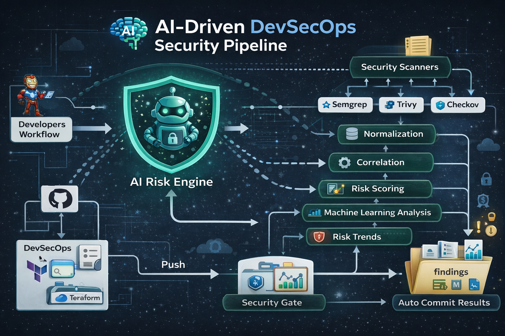

# AI-Assisted DevSecOps Risk Assessment

This project implements an **AI-assisted DevSecOps pipeline** that automatically scans application code, infrastructure, and dependencies to identify vulnerabilities, correlate findings, compute explainable risk scores, and enforce security gates inside a CI/CD pipeline.

The system integrates multiple security tools and applies **machine learning and explainable risk scoring** to prioritize vulnerabilities and automate security decisions.

---

# Architecture



The architecture represents an **AI-driven DevSecOps security pipeline** where multiple security scanners generate findings that are normalized, correlated, scored, and analyzed using machine learning before enforcing a security gate.

Pipeline flow:
Developer Push
↓
Security Scanners
(Semgrep, Trivy, Checkov)
↓
Normalization Engine
↓
Correlation Engine
↓
Explainable Risk Scoring
↓
Machine Learning Risk Analysis
↓
Security Visualization
↓
Security Gate
↓
Automated Security Reports


---

# Key Features

This system implements the following DevSecOps capabilities:

### Static Code Security
- **Semgrep** scans source code for security vulnerabilities and insecure coding patterns.

### Dependency & Container Security
- **Trivy** detects vulnerabilities in dependencies and container images.

### Infrastructure Security
- **Checkov** scans Terraform and infrastructure configuration files to detect security misconfigurations.

### Security Finding Normalization
Security findings from different tools are converted into a **common structured format** to enable cross-tool analysis.

### Vulnerability Correlation
Duplicate or related vulnerabilities detected by multiple scanners are **correlated and deduplicated**.

### Explainable Risk Scoring
Each vulnerability is evaluated using a **weighted risk model** considering:

- Severity
- Exposure
- Asset criticality
- Tool confidence
- Finding freshness

This creates a **transparent and explainable risk score** for each finding.

### Machine Learning Risk Prediction
A machine learning model analyzes the computed risk scores and predicts **high-risk vulnerabilities**.

### Security Visualization
The pipeline automatically generates visual reports such as:

- Risk distribution
- Tool contribution analysis
- Top risky assets
- Security trend across commits

### CI/CD Security Gate
The pipeline enforces a **security gate** that blocks deployments when the risk threshold is exceeded.

---

# Technology Stack

| Category | Tools |
|--------|--------|
| SAST | Semgrep |
| Dependency Scanning | Trivy |
| Infrastructure Security | Checkov |
| Infrastructure as Code | Terraform |
| Programming Language | Python |
| ML Libraries | Scikit-learn, Pandas |
| Visualization | Matplotlib |
| CI/CD | GitHub Actions |

---

# DevSecOps Pipeline

The CI/CD pipeline is implemented using **GitHub Actions** and performs the following steps:
1.Run Security Scanners
2.Normalize Findings
3.Correlate Vulnerabilities
4.Compute Risk Scores
5.Run Machine Learning Analysis
6.Generate Security Visualizations
7.Apply Security Gate
8.Commit Security Reports


Security results are automatically stored in the `findings/` directory.

---

# Repository Structure
.
├── app/
│ └── starbucks/
│
├── Architecture/
│ └── Architecture.png
│
├── findings/
│ ├── risk_report.json
│ ├── risk_report.md
│ ├── risk_distribution.png
│ ├── tool_contribution.png
│ └── top_risky_assets.png
│
├── risk_engine/
│ ├── normalize.py
│ ├── correlate.py
│ ├── score.py
│ ├── ml_model.py
│ ├── visualize.py
│ └── gate.py
│
├── terraform/
│
└── .github/workflows/
└── security_pipeline.yml


---

# Running Locally

Run the security pipeline locally:

```bash
# Run security scanners
semgrep --config=auto app/starbucks --json > findings/semgrep.json
trivy fs --format json --output findings/trivy.json app/starbucks
checkov -d app/starbucks --output json > findings/checkov.json

# Normalize findings
python risk_engine/normalize.py

# Correlate vulnerabilities
python risk_engine/correlate.py

# Compute risk scores
python risk_engine/score.py

# Run ML model
python risk_engine/ml_model.py

# Generate visualizations
python risk_engine/visualize.py

# Apply security gate
python risk_engine/gate.py
```
---

# Future Improvements
Possible improvements include:
1.Real-time security dashboards
2.Kubernetes runtime security monitoring
3.Integration with SIEM platforms
4.Risk prediction using larger datasets
5.Automated remediation recommendations
---
Author
MD SOHAIL SHAIKH
Cybersecurity Case Study Project

---
